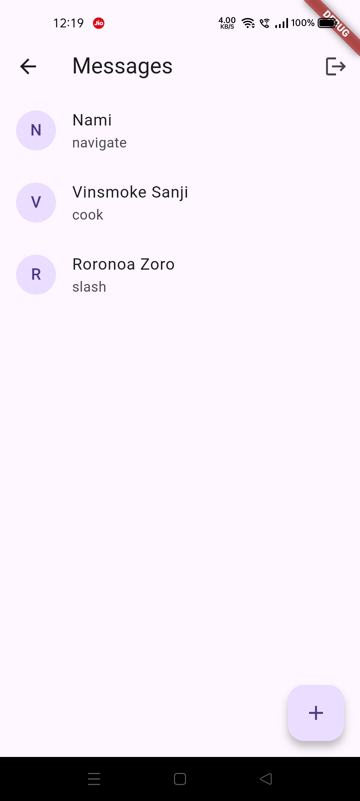

# Overview

A real-time chat application built with Flutter and Firebase, allowing users to register, log in, find other users, and exchange text and image messages. This project demonstrates Firebase Authentication, Firestore for real-time data, and image handling with local storage.

## Features
- **User Authentication**: Register and log in using email and password.
- **Real-Time Messaging**: Send and receive text messages instantly.
- **Image Sharing**: Share images from the gallery, stored locally and referenced in Firestore.
- **Chat Management**: Initiate chats with other users via email search.
- **Secure Data**: Firestore security rules ensure users only access their own chats and messages.
- **Responsive UI**: Built with Flutter’s `dash_chat_2` for a modern chat interface.

## Screenshots
| Login | Register | Find | Chats | Message (Active) | Message (Deactive) |
|-------|----------|------|-------|------------------|-------------------|
|  |  |  |  |  |  |

## Setup Instructions
1. **Clone the Repository**:
   ```bash
   git clone https://github.com/Vaibhav23rd/firebase_chat_app.git
   cd firebase_chat_app
   ```

2. **Install Dependencies**:
   ```bash
   flutter pub get
   ```

3. **Configure Firebase**:
   - Create a Firebase project in the [Firebase Console](https://console.firebase.google.com/).
   - Add an Android app and download `google-services.json` to `android/app/`.
   - (Optional) Add an iOS app and place `GoogleService-Info.plist` in `ios/Runner/`.
   - Run:
     ```bash
     flutterfire configure
     ```
     to generate `lib/firebase_options.dart`.

4. **Deploy Firestore Rules**:
   - Install Firebase CLI:
     ```bash
     npm install -g firebase-tools
     ```
   - Login:
     ```bash
     firebase login
     ```
   - Deploy rules:
     ```bash
     firebase deploy --only firestore:rules
     ```

5. **Run the App**:
   ```bash
   flutter run
   ```

## Project Structure
- `lib/screens/`: UI screens (`chat_screen.dart`, `home_screen.dart`, etc.).
- `lib/services/`: Firebase and chat logic (`chat_service.dart`, `auth_service.dart`).
- `lib/models/`: Data models (`user.dart`, `message.dart`).
- `firestore.rules`: Firestore security rules.
- `.gitignore`: Excludes sensitive files like `google-services.json`.

## Dependencies
- `flutter`
- `cloud_firestore`
- `firebase_auth`
- `firebase_core`
- `dash_chat_2`
- `image_picker`
- `path_provider`
- `fluttertoast`
- `uuid`

## Contributing
Feel free to open issues or submit pull requests for improvements or bug fixes.

## License
MIT License
